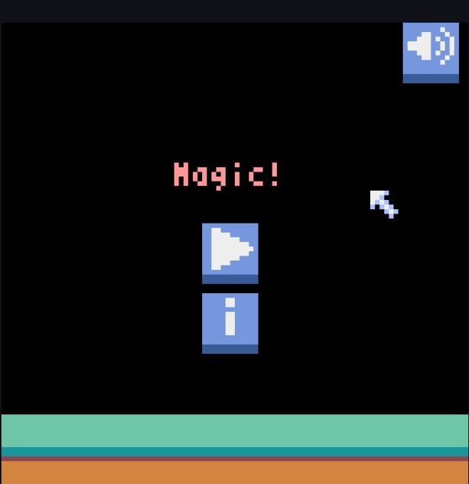
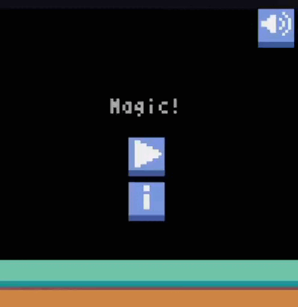

# Magic!

<header>
    
    
</header>

    
Controle um mago, lute contra goblins e sobreviva o máximo possível.

    
    
    
<h4 align=center>🚧 Game Em construção...🎮🚀🚧</h4>

<footer>
    

        
    

<footer>
