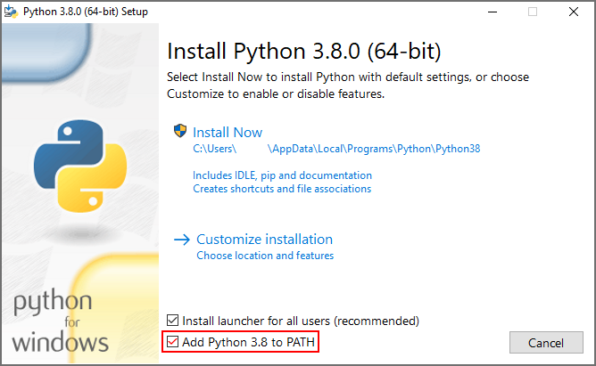

# Magic!
<header>
    
    
</header>

    
Controle um mago, lute contra goblins e sobreviva o máximo possível.

    
    
    
<h4>🚧 Game em construção...🎮🚀🚧</h4>

<h2>Especificações
</h2>
    <ul>
        <li>Escrita em código com <a href="https://www.python.org" target="_blank">Python3</a></li>
    </ul>

<h2>requisitos</h2>

    <ul>
        <li>python3(versão3.9 ou superior)</li>
        <li>get-pip.py</li>
        <li>pip</li>
        <li>pyxel(Versão 1.4.3)</li>
    </ul>

<h2>Como instalar</h2>

    <ul>
        <li>Instale o <a href="https://www.python.org" target="_blank">Python3</a>(versão3.8 ou superior)</li>
        <li>adicione Python ao <b>PATH</b> 

</li> 
        <li>Em seguida, instale pyxel com o seguinte comando no prompt de comando:
<code>pip install pyxel</code>
</li>
    </ul>

<h2>Autor</h2>
 

<b>Abel Lucas</b>🎮

<h2>Licença</h2>
 

Magic! utiliza:

    <ul>
        <li>python</li>
        <li>pyxel</li>
    </ul>

    
<footer>
    

        
    

<footer>
